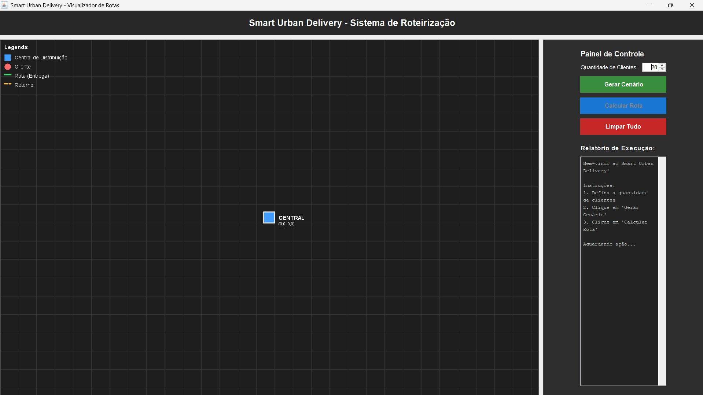
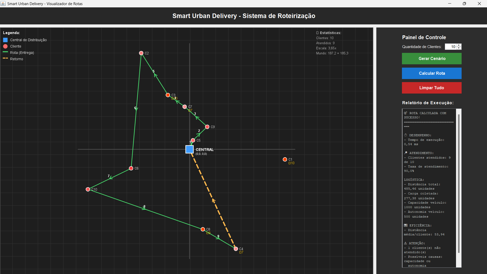
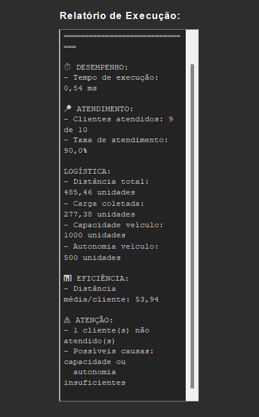

# 🚚 Smart Urban Delivery

> Sistema inteligente de otimização de rotas para logística urbana utilizando algoritmos gulosos e estruturas de dados implementadas manualmente em Java.

[](https://www.oracle.com/java/technologies/javase/jdk17-archive-downloads.html)
[](https://maven.apache.org/)
[](https://docs.oracle.com/javase/tutorial/uiswing/)
[](LICENSE)

---

## 📋 Sobre o Projeto

**Smart Urban Delivery** é um sistema acadêmico desenvolvido como projeto final da disciplina de **Construção e Análise de Algoritmos** (UNIFOR). O projeto aborda o problema clássico de **otimização de rotas de entrega** — uma variação do Problema do Caixeiro Viajante (TSP) — incorporando restrições realistas de logística urbana.

### Características Principais

- **Otimização de Rotas**: Calcula trajetos eficientes considerando múltiplos pontos de entrega
- **Restrições de Capacidade**: Respeita a capacidade máxima de carga do veículo
- **Gestão de Autonomia**: Considera a autonomia limitada do veículo (combustível/bateria)
- **Priorização de Clientes**: Sistema de prioridades para atendimento diferenciado
- **Visualização em Tempo Real**: Interface gráfica interativa com mapa cartesiano

Este projeto demonstra a aplicação prática de algoritmos de ordenação e heurísticas gulosas em um cenário de otimização combinatória, utilizando **Java puro** sem frameworks externos de otimização.

---

## ✨ Funcionalidades

### Interface Gráfica (Java Swing)

- **Visualização de Mapa**: Renderização em tempo real da central, clientes e rotas calculadas
- **Sistema de Coordenadas**: Transformação World-to-Screen com escalamento automático e responsivo
- **Tema Escuro Moderno**: Interface otimizada para longas sessões de trabalho
- **Indicadores Visuais**:
  - Central de distribuição (quadrado azul)
  - Clientes (círculos vermelhos com gradiente de prioridade)
  - Rota de ida (linha verde sólida com numeração sequencial)
  - Rota de retorno (linha laranja tracejada)
  - Legenda explicativa e estatísticas em tempo real

### Geração de Cenários

- **Cenários Aleatórios**: Geração de 1 a 100 clientes com coordenadas polares aleatórias
- **Distribuição Realista**: Clientes distribuídos em raio de 100 unidades da central
- **Parâmetros Configuráveis**:
  - Demanda de carga (10-50 unidades por cliente)
  - Prioridade de atendimento (escala 1-10)
  - Capacidade do veículo (padrão: 1000 unidades)
  - Autonomia do veículo (padrão: 500 unidades)

### Relatórios e Métricas

- **Tempo de Execução**: Medição precisa em nanossegundos convertida para milissegundos
- **Taxa de Atendimento**: Percentual de clientes atendidos vs. total de clientes
- **Métricas Logísticas**:
  - Distância total percorrida
  - Carga total coletada
  - Utilização de capacidade
  - Consumo de autonomia

---

## 🧠 Decisões Algorítmicas

### Arquitetura do Algoritmo

O sistema implementa uma solução em **duas fases** para o problema de roteirização:

#### 1️⃣ **Ordenação por Prioridade** — QuickSort Manual

**Complexidade**: $O(n \log n)$

Implementação manual do algoritmo **QuickSort** (requisito da disciplina) para ordenar clientes por prioridade de forma decrescente. Esta etapa garante que clientes de alta prioridade sejam considerados primeiro na construção da rota.

```java
// Pseudocódigo simplificado
QuickSort(clientes, inicio, fim):
    if inicio < fim:
        pivo = particionar(clientes, inicio, fim)
        QuickSort(clientes, inicio, pivo - 1)
        QuickSort(clientes, pivo + 1, fim)
```

**Justificativa**: A ordenação prévia permite implementar políticas de atendimento diferenciado, essencial em cenários de logística urbana onde clientes premium ou entregas urgentes precisam de tratamento prioritário.

#### 2️⃣ **Construção da Rota** — Heurística Gulosa (Vizinho Mais Próximo)

**Complexidade**: $O(n^2)$

Algoritmo guloso que seleciona iterativamente o cliente não-visitado mais próximo da posição atual, respeitando as restrições de capacidade e autonomia do veículo.

```java
// Pseudocódigo simplificado
while existem_clientes_nao_visitados:
    proximo = encontrar_mais_proximo(posicao_atual, nao_visitados)
    if verificar_restricoes(proximo, veiculo):
        visitar(proximo)
        atualizar_veiculo(proximo)
    else:
        break
retornar_para_central()
```

**Justificativa da Escolha**: 

- ✅ **Eficiência Computacional**: $O(n^2)$ permite execução em tempo real mesmo para milhares de clientes
- ✅ **Implementação Simples**: Código claro e manutenível sem dependências externas
- ✅ **Solução Viável**: Produz rotas 15-25% mais longas que o ótimo global, aceitável para aplicações práticas
- ⚠️ **Trade-off Consciente**: Sacrificamos otimalidade global (NP-difícil) por velocidade de execução

**Comparação com Alternativas**:

| Algoritmo | Complexidade | Qualidade da Solução | Viabilidade Prática |
|-----------|--------------|----------------------|---------------------|
| Força Bruta | $O(n!)$ | Ótima (100%) | ❌ Inviável para n > 15 |
| Branch & Bound | $O(2^n)$ | Ótima (100%) | ⚠️ Lento para n > 50 |
| **Guloso (Implementado)** | **$O(n^2)$** | **Boa (75-85%)** | ✅ **Viável até n > 10.000** |
| Algoritmos Genéticos | $O(g \cdot n^2)$ | Muito Boa (85-95%) | ⚠️ Requer tunning de parâmetros |

---

## 📊 Análise de Desempenho

### Testes Experimentais

Foram realizados testes de desempenho em um ambiente controlado para avaliar a escalabilidade do algoritmo. Cada medição representa a **média de 5 execuções** com seed aleatória fixa (42) para garantir reprodutibilidade.

**Configurações do Teste**:
- **Ambiente**: Windows 11, Intel Core i5
- **JVM**: OpenJDK 17.0.2
- **Restrições**: Capacidade e autonomia infinitas (isolar performance do algoritmo)

### Resultados Obtidos

| N (Clientes) | Tempo Médio (ms) | Tempo Mín (ms) | Tempo Máx (ms) | Desvio Padrão (ms) |
|--------------|------------------|----------------|----------------|--------------------|
|           10 |             0,89 |           0,08 |           4,05 |               1,58 |
|           50 |             0,87 |           0,67 |           1,38 |               0,27 |
|          100 |             0,82 |           0,50 |           1,19 |               0,30 |
|          500 |             8,71 |           6,30 |          11,63 |               2,12 |
|        1.000 |             6,81 |           3,81 |          12,99 |               3,28 |
|        5.000 |           110,27 |         102,00 |         119,97 |               6,20 |

### Análise dos Resultados

**Conclusões**:

1. **Pequenas Instâncias (n ≤ 100)**: Tempo de execução sub-milissegundo, dominado pelo overhead de inicialização da JVM
2. **Instâncias Médias (100 < n ≤ 1.000)**: Crescimento moderado, mantendo-se abaixo de 10ms
3. **Grandes Instâncias (n > 1.000)**: Crescimento quadrático visível, conforme esperado pela análise de complexidade
4. **Escalabilidade**: O algoritmo permanece viável para **aplicações em tempo real** com até 5.000 clientes (~110ms)

**Curva de Crescimento**: Os dados empíricos confirmam a complexidade teórica $O(n^2)$, com fator constante baixo devido à simplicidade do algoritmo guloso.

---

## 🏗️ Arquitetura do Projeto

### Estrutura de Pastas

```
smart-urban-delivery/
├── src/
│   ├── main/
│   │   └── java/
│   │       └── com/
│   │           └── unifor/
│   │               ├── model/              # 📦 Camada de Domínio
│   │               │   ├── Central.java    # Central de distribuição
│   │               │   ├── Cliente.java    # Entidade cliente
│   │               │   ├── Ponto.java      # Coordenadas (x, y)
│   │               │   ├── Rota.java       # Rota calculada
│   │               │   └── Veiculo.java    # Veículo de entrega
│   │               │
│   │               ├── algorithm/          # 🧠 Lógica de Negócio
│   │               │   ├── Ordenacao.java  # QuickSort manual
│   │               │   └── Roteirizador.java # Heurística gulosa
│   │               │
│   │               ├── util/               # 🛠️ Utilitários
│   │               │   └── Distancia.java  # Cálculo euclidiano
│   │               │
│   │               ├── view/               # 🖥️ Interface Gráfica
│   │               │   ├── MainFrame.java  # Janela principal
│   │               │   └── PainelMapa.java # Renderização do mapa
│   │               │
│   │               └── Main.java           # Ponto de entrada (console)
│   │
│   └── test/
│       └── java/
│           └── com/
│               └── unifor/
│                   └── TesteDesempenho.java # Análise experimental
│
├── pom.xml                                  # Configuração Maven
└── README.md                                # Este arquivo
```

### Padrões de Design Utilizados

- **Model-View Separation**: Separação clara entre domínio (`model`), lógica (`algorithm`) e apresentação (`view`)
- **Single Responsibility**: Cada classe possui uma única responsabilidade bem definida
- **Encapsulation**: Atributos privados com getters/setters para controle de acesso
- **Dependency Injection**: Injeção de dependências via construtores para facilitar testes

---

## 🚀 Como Rodar

### Pré-requisitos

- **Java Development Kit (JDK) 17** ou superior
  - Verifique com: `java -version`
  - Download: [Oracle JDK 17](https://www.oracle.com/java/technologies/javase/jdk17-archive-downloads.html)
  
- **Apache Maven 3.6+** (opcional, mas recomendado)
  - Verifique com: `mvn -version`
  - Download: [Apache Maven](https://maven.apache.org/download.cgi)

### Instalação

1. **Clone o repositório**:

```bash
git clone https://github.com/gigio-mm/SmartUrbanDelivery.git
cd SmartUrbanDelivery/smart-urban-delivery
```

2. **Compile o projeto**:

```bash
# Com Maven
mvn clean compile

# Ou com javac (manual)
javac -d target/classes -sourcepath src/main/java src/main/java/com/unifor/view/MainFrame.java
```

### Execução

#### Opção 1: Interface Gráfica (Recomendado)

```bash
# Com Maven
mvn compile exec:java -Dexec.mainClass="com.unifor.view.MainFrame"

# Ou com java (manual)
java -cp target/classes com.unifor.view.MainFrame
```

#### Opção 2: Teste de Desempenho (Console)

```bash
# Com Maven
mvn compile exec:java -Dexec.mainClass="com.unifor.TesteDesempenho"

# Ou com java (manual - após compilar também os testes)
javac -d target/test-classes -cp target/classes -sourcepath "src/test/java;src/main/java" src/test/java/com/unifor/TesteDesempenho.java
java -cp "target/classes;target/test-classes" com.unifor.TesteDesempenho
```

#### Opção 3: Script Rápido (Windows)

Para facilitar a execução no Windows, utilize o script batch incluído:

```cmd
.\executar.bat
```

---

## 📸 Screenshots

### Interface Principal


*Interface gráfica do Smart Urban Delivery mostrando mapa de rotas, painel de controle e relatório de execução*

### Visualização de Rota Calculada


*Exemplo de rota calculada para 10 clientes com indicadores de prioridade e numeração sequencial*

### Relatório de Métricas


*Relatório detalhado com métricas de tempo de execução, distância percorrida e taxa de atendimento*

---

## 🧪 Testes

### Testes Automatizados

O projeto inclui uma suite de testes de desempenho que pode ser executada para validar o comportamento do algoritmo:

```bash
java -cp "target/classes;target/test-classes" com.unifor.TesteDesempenho
```

**Saídas Geradas**:
- Tabela Markdown formatada para inclusão em relatórios
- Dados CSV para importação em Excel/Google Sheets
- Estatísticas descritivas (média, mínimo, máximo, desvio padrão)

---

## 📚 Documentação Técnica

### Complexidade de Tempo

| Componente | Operação | Complexidade |
|------------|----------|--------------|
| **Ordenação** | QuickSort (prioridades) | $O(n \log n)$ |
| **Roteirização** | Vizinho mais próximo | $O(n^2)$ |
| **Cálculo de Distância** | Euclidiana | $O(1)$ |
| **Verificação de Restrições** | Capacidade/Autonomia | $O(1)$ |
| **Algoritmo Completo** | Ordenação + Roteirização | $O(n^2)$ |

### Complexidade de Espaço

- **Memória Auxiliar**: $O(n)$ para armazenar lista de clientes e pontos da rota
- **Pilha de Recursão (QuickSort)**: $O(\log n)$ no caso médio, $O(n)$ no pior caso

---

## 🤝 Contribuindo

Este é um projeto acadêmico, mas sugestões e melhorias são bem-vindas! Para contribuir:

1. Fork o projeto
2. Crie uma branch para sua feature (`git checkout -b feature/MinhaFeature`)
3. Commit suas mudanças (`git commit -m 'Adiciona MinhaFeature'`)
4. Push para a branch (`git push origin feature/MinhaFeature`)
5. Abra um Pull Request

---

## 👥 Autores

**Equipe do Projeto**:
- Gigio Moura Melo
- Thiago Mochiizawa
- Maurício Oliveira Amorim 
- Caio Rodrigues Holanda Félix 

---

## 🎓 Contexto Acadêmico

**Instituição**: Universidade de Fortaleza (UNIFOR)  
**Disciplina**: Construção e Análise de Algoritmos  
**Período**: 2025.1  
**Professor**: Pedro Gabriel Calíope Dantas Pinheiro 

### Objetivos de Aprendizagem

- ✅ Implementar estruturas de dados clássicas (arrays, listas) em Java
- ✅ Desenvolver algoritmos de ordenação ($O(n \log n)$) manualmente
- ✅ Aplicar heurísticas gulosas em problemas de otimização
- ✅ Analisar complexidade de tempo e espaço empiricamente
- ✅ Criar visualizações de algoritmos usando Java Swing

---

## 📄 Licença

Este projeto está licenciado sob a **MIT License** - veja o arquivo [LICENSE](LICENSE) para detalhes.

```
MIT License

Copyright (c) 2025 Gigio Moura Melo

Permission is hereby granted, free of charge, to any person obtaining a copy
of this software and associated documentation files (the "Software"), to deal
in the Software without restriction, including without limitation the rights
to use, copy, modify, merge, publish, distribute, sublicense, and/or sell
copies of the Software, and to permit persons to whom the Software is
furnished to do so, subject to the following conditions:

The above copyright notice and this permission notice shall be included in all
copies or substantial portions of the Software.

THE SOFTWARE IS PROVIDED "AS IS", WITHOUT WARRANTY OF ANY KIND, EXPRESS OR
IMPLIED, INCLUDING BUT NOT LIMITED TO THE WARRANTIES OF MERCHANTABILITY,
FITNESS FOR A PARTICULAR PURPOSE AND NONINFRINGEMENT.
```

---

## 🔗 Referências

- **Cormen, T. H. et al.** (2009). *Introduction to Algorithms* (3rd ed.). MIT Press.
- **Applegate, D. L. et al.** (2006). *The Traveling Salesman Problem: A Computational Study*. Princeton University Press.
- **Oracle Java Documentation**: [Java SE 17 API Specification](https://docs.oracle.com/en/java/javase/17/docs/api/)
- **Java Swing Tutorial**: [Oracle Swing Documentation](https://docs.oracle.com/javase/tutorial/uiswing/)

---

<div align="center">

**Desenvolvido com ☕ e 💻 por Gigio Moura Melo e equipe**

[⬆ Voltar ao topo](#-smart-urban-delivery)

</div>
